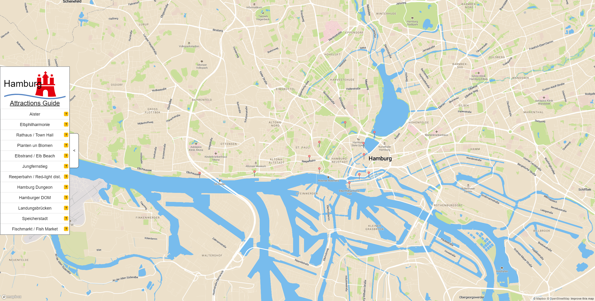

# Hamburg Attraction Guide App :city_sunset:

> If you have always wanted to visit the most beautiful city in Germany, this is your guide. (Berlin looks like a one big construction site against it) :wink:


### :computer: Core - Technologies:
* [node: v10.16.0 LTS](https://nodejs.org/de/download/)
* [npm: v6.9.0](https://nodejs.org/de/download/)
* [mapbox-gl.js](https://docs.mapbox.com/mapbox-gl-js/api/)
* [axios.js](https://github.com/axios/axios)
* [boostrap](https://getbootstrap.com/docs/4.3/getting-started/introduction/)
* [node-sass](https://www.npmjs.com/package/node-sass)
* [express.js](https://expressjs.com/)

### :construction: Installing:
Using npm:
```
npm install
```

Start Application:
```
npm run start
```

Start SCSS Compiler:
```
npm run scss
```

Application will be as default running at: [localhost:3000](http://localhost:3000)
